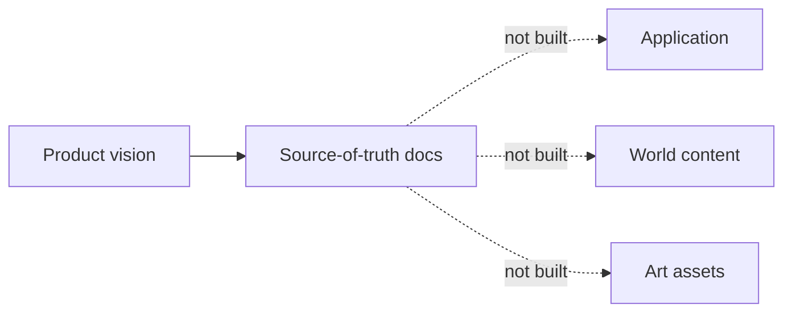
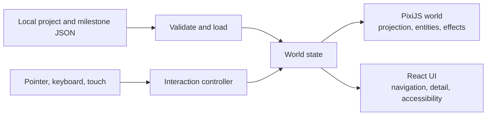
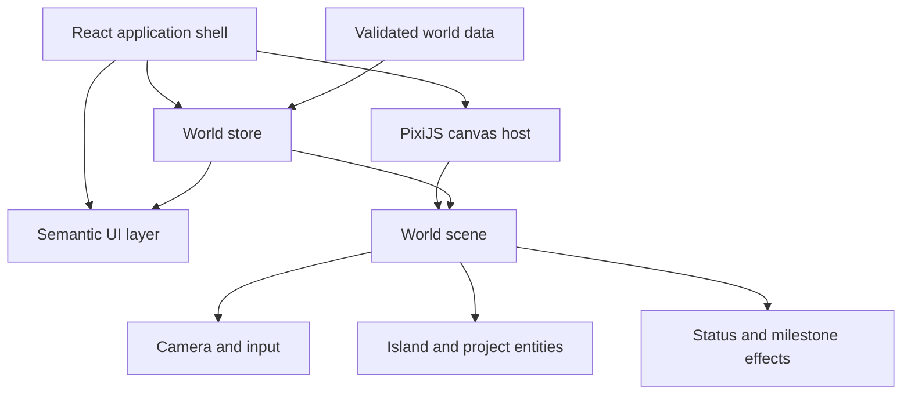
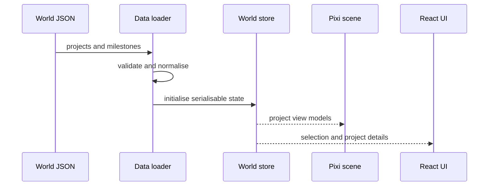
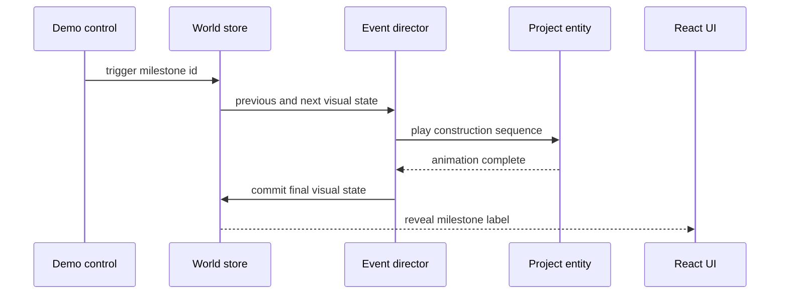
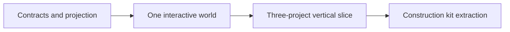

# Sibling Shipyard — Architecture

## Context

Today the project consists only of its product definition. We need a browser-native foundation that proves a data-driven 2.5D world without committing to backend infrastructure, realistic 3D, or a large asset pipeline.

## Current state

The source of truth is [README.md](README.md), [ROADMAP.md](ROADMAP.md), and [DESIGN.md](DESIGN.md). No application, asset library, content schema, deployment target, or external integration exists yet.



## Goal state



One serialisable world state drives both renderers. PixiJS owns scene rendering and hit regions; React owns semantic UI and accessibility. Neither reads raw JSON directly after startup.

## Assumptions and locked decisions

### Locked for Shipyard Zero

- **Runtime:** browser application built with React, TypeScript, and Vite
- **World renderer:** PixiJS using WebGL/canvas, not DOM-positioned scenery
- **Projection:** fixed 2.5D isometric mapping over logical grid coordinates
- **Content:** checked-in JSON validated at load time
- **State:** a small framework-independent store and explicit actions
- **Visual implementation:** programmatic PixiJS geometry and a small deterministic tileset first; authored sprites remain a compatible later upgrade
- **Testing:** unit tests for projection and transitions, browser tests for the magic moment

### Deferred forks

- Hosting provider and analytics
- State library choice until local complexity justifies one
- Backend, CMS, authentication, and database
- External milestone ingestion and approval workflow
- SVG-at-runtime versus pre-rasterised sprite pipeline
- Web workers, spatial partitioning, and advanced batching

### Renderer reassessment gate

PixiJS remains locked through the Orion Hero Plot milestone. Reassess with a focused Three.js spike only if the accepted product requires free camera rotation, viewpoint-dependent occlusion, real-time world lighting, extreme close zoom, or genuinely three-dimensional assembly.

Visual polish alone is not a switch trigger: both engines require authored architecture, materials, landscaping, lighting, and animation direction.

## High-level design

### Runtime topology



### Content-to-world flow



### Milestone flow



The event director translates a state difference into named reusable beats. It does not contain project-specific artwork or business rules.

## Low-level design

### Projection and depth

Logical tile coordinates remain independent from pixels:

```text
screenX = originX + (gridX - gridY) × halfTileWidth
screenY = originY + (gridX + gridY) × halfTileHeight - elevation
depthKey = gridX + gridY + elevationBand
```

The projection module is pure and unit-tested. Render order uses stable depth keys plus explicit bands for ground, structures, props, characters, and effects.

### Initial project contract

```ts
type ProjectStage = "idea" | "experiment" | "prototype" | "shipped" | "growing" | "landmark"
type ProjectStatus = "building" | "shipping" | "live" | "growing" | "paused" | "archived" | "incident"

interface ProjectDefinition {
  id: string
  name: string
  summary: string
  stage: ProjectStage
  status: ProjectStatus
  grid: { x: number; y: number }
  building: {
    archetype: "workshop" | "studio" | "tower"
    modules: Array<"lab-floor" | "beta-floor" | "office-floor" | "tower-floor" | "sky-wing">
    roof?: "crane" | "beacon" | "antenna"
    accent: string
  }
  latestMilestoneId?: string
  nextMilestone?: string
  links?: Array<{ label: string; href: string }>
}

interface MilestoneDefinition {
  id: string
  projectId: string
  title: string
  date: string
  event: "construction-upgrade"
  resultingModules: ProjectDefinition["building"]["modules"]
}
```

Validate unique IDs, valid project references, occupied grid positions, safe link protocols, and known asset keys before initialising the scene. Invalid content fails visibly in development rather than partially rendering.

The building factory dispatches exclusively from `building.archetype`. Project IDs remain identity and lookup keys; changing an ID or reordering the project data must not change which renderer is used.

Within an archetype, ordered module keys and the optional roof key are instantiated through shared production part factories. Repeated module keys add repeated mass; removing a key removes that piece. Archetype compatibility is validated before Pixi initialises. Milestones use the same module vocabulary, so the animated Public Beta floor is the exact `beta-floor` shown in the Visual system.

### Town layout contract

`TownLayout` is the single source for map dimensions, road/plaza/water cells, bridges, decor placements, and ambient routes. Both the environment renderer and ambient actors consume the same validated layout. Project plots are checked against its bounds and non-buildable infrastructure before the World is created.

The layout validator rejects overlapping surfaces, out-of-bounds records, unknown decor, bridges that do not cross water, diagonal routes, vehicles leaving the road network, pedestrians crossing water, and projects placed on roads or water. Rendering order is derived from grid depth, so reordering manifest records does not change the scene.

The Visual system's Layout section renders the production environment with a diagnostic overlay showing the grid, prop anchors, project footprints, and actor route. It introduces no second set of map coordinates.

### Project visual composition

Each project plot is assembled from four independent concerns:

1. **Identity shell** — the project-specific silhouette (Orion, Spark, Nexus).
2. **Stage treatment** — permanent maturity earned from idea through landmark.
3. **Status treatment** — temporary operating condition such as live, paused, or incident.
4. **Milestone layer** — transient choreography that deterministically lands in a data-defined final state.

Stage is never inferred from status, and milestone playback does not silently mutate stage. World and Visual system consume the same stage and status factories.

### Store boundary

The minimal state is `projects`, `milestones`, `selectedProjectId`, `cameraTarget`, `activeEvent`, and `motionPreference`. Actions are `selectProject`, `clearSelection`, `setCameraTarget`, `triggerMilestone`, and `completeMilestone`.

Animation progress stays inside PixiJS objects and does not enter React state each frame. Only meaningful transitions cross the store boundary.

### Performance guardrails

- One PixiJS application and render loop
- Sprite sheets and shared textures instead of repeated asset instances
- No React updates on pointer movement or animation frames
- Camera culling and advanced batching only after profiling demonstrates need
- Shipyard Zero performance target: smooth interaction on a representative mid-range phone and laptop, measured before M2 exits

## Milestones

Architecture delivery follows [ROADMAP.md](ROADMAP.md). [IMPLEMENTATION_PLAN.md](IMPLEMENTATION_PLAN.md) contains the file-level sequence for M0–M2.



## Risks and open questions

- **Asset consistency:** approve a reference sheet before scaling production.
- **Occlusion errors:** prove depth sorting with overlapping tall props early.
- **React/Pixi duplication:** keep one store and a strict ownership boundary.
- **Mobile comfort:** test pinch, scroll, target sizes, and reduced motion in M1.
- **Milestone determinism:** event animation must always end at the data-defined state.
- What representative devices define the initial performance bar?
- Which real project links and descriptions may be public?

## Long-term vision — rough, not committed

- Replace local JSON with a versioned content service while retaining the same validated contracts.
- Derive any historical world from an event log, enabling timeline travel.
- Add reviewed adapters for releases, users, revenue, and operational status.
- Introduce spatial indexing and worker-assisted layout only when world scale requires them.

## Appendix

Planned references: `app/src/data` for validation and loading, `app/src/world/projection` for pure isometric maths, `app/src/world/entities` for scene objects, `app/src/world/systems` for camera and events, `app/src/ui` for semantic interface, and `world/*.json` for content.
