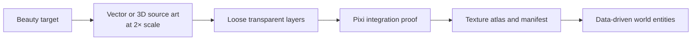
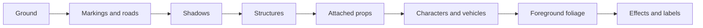

# Sibling Shipyard — Asset Pipeline

## Context

The beauty target establishes composition and finish, but it contains baked lighting and occlusion and must not be cut into runtime sprites. Shipyard Zero needs a small re-authored layered kit for the fixed 96 × 48 isometric camera.

## Pipeline



Source art may be drawn in a vector tool or modeled and pre-rendered in Blender. The browser receives transparent WebP or PNG layers and atlas metadata, not live 3D geometry.

## First production pass

- One terrain intersection: grass, road, curb, cliff, and shadow
- Orion: plot, base, floors, scaffold, crane mast, jib, hook, materials, and upgrade floor
- Canonical person, tree, and service vehicle
- Desktop golden screenshot plus mobile and 50% crops

Spark, Nexus, broad prop packs, and atlas optimization wait until Orion passes.

## Asset contract

```text
asset key: building/orion/module/floor-01
runtime tile: 96 × 48
source scale: 2×
anchor: ground-contact center
footprint: width and depth in tiles
depth band: ground, shadow, structure, prop, character, foliage, effect
state tags: optional building, live, growing
animation pivot: optional local point
```

- Stable lowercase slash keys, never filename-derived behavior
- Important detail at least 6 source pixels, equal to 3 runtime pixels
- Separate shadows from anchor bounds
- Animated crane and floor parts exported separately
- No atlas frame rotation initially
- Shared neutral modules remain tintable only when tinting preserves shading

## Layer order



## Approval gates

- Silhouette reads without label or accent
- Human, door, floor, tree, vehicle, and crane scales agree
- Global upper-left light and lower-right shadows remain consistent
- Road, grass, curb, and cliff joins show no seams
- Status remains legible in grayscale
- Anchors do not jump during module or state swaps
- Smallest meaningful detail survives 50% scale
- Reduced motion reaches the identical final assembled state
- First-view atlas target stays below 2 MB compressed

## Three.js switch triggers

- Free camera rotation or tilt becomes a product requirement
- Dynamic day/night lighting must affect the whole world
- Close zoom exposes unacceptable fixed-angle sprite limitations
- Construction must assemble or deform true 3D geometry
- One asset must render convincingly from multiple viewpoints

Until one of these is accepted, PixiJS remains the simpler production renderer.
