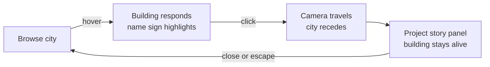

# Sibling Shipyard — Experience and Visual Design

## Context

The Shipyard must communicate a portfolio, current activity, and accumulated history through a single explorable world. The first design task is proving a coherent visual grammar with three projects that feels bold, narrative, and alive.

## Experience goal

Within ten seconds, a visitor should understand: **"This is a living tech city of everything Akash and Skanda are building."** The world opens with energy and density — buildings have prominent identity, the streets are alive with people and vehicles, and status effects tell dramatic stories at a glance.

## Art direction

**Primary reference:** eBoy pixel-art cityscapes and the Silicon Valley HBO opening credits by Christoph Niemann. Each building is a character with personality, branding, and architectural narrative. The city is dense, playful, and slightly satirical.

| Property | Rule |
|---|---|
| Tone | Bold, saturated, playful — a premium city-builder, not a meditation app |
| Projection | Fixed isometric, based on a consistent tile grid |
| Geometry | Chunky, modular, silhouette-first, with strong architectural personality |
| Colour | Vivid, saturated palette — bold greens, warm grays, rich accents. NOT pastels |
| Lighting | One global direction (upper-left ~10:30), strong directional shadows for depth |
| Outlines | Absent — form communicated through bold colour blocks and face-value contrast |
| Texture | Minimal, but buildings have material variety (glass, concrete, steel, panels) |
| Scale | Standardised people, vehicles, props, floors, and tiles |
| Signage | Every project building has **prominent text branding** (project name visible from city scale) |
| Motion | Ambient by default, **dramatic and exaggerated** for status effects and events |
| Density | **Dense and alive** — people, vehicles, construction equipment, street furniture |
| Status effects | **Visually dramatic** — incident = actual fire and smoke, building = real cranes and scaffolding |

### What this is NOT

- Not calm, sparse, or meditative (that was the old direction)
- Not pastel or muted — colours are vivid and confident
- Not minimal — the world should feel busy, layered, and explorable
- Not subtle about status — if a building is on fire, it should be ON FIRE 🔥

## First-load composition

```text
warm sky gradient or neutral background

                  [ NEXUS · tower + expansion cranes ]
                         │
                    wide asphalt road with markings
                     ╱         ╲
   [ ORION · crane + scaffold ]   [ SPARK · glowing sign ]
                     ╲         ╱
                    vehicles, pedestrians

                 island edge / city block boundary
```

- Camera starts slightly wide, then settles into the browsing position.
- The fixed isometric view uses restrained parallax, not free rotation.
- Three strong silhouettes remain legible without labels, but **each building also has prominent signage**.
- Roads are wide urban asphalt with painted lane markings, crosswalks, and traffic.
- The city feels alive from the first frame — people walking, vehicles moving, construction sounds implied through visual activity.

## Visual language — Buildings

Each building is a **character**, not just a shape. It should feel like the eBoy tech cityscapes where you can identify every company by its architecture and signage.

### Building anatomy

```text
Project building
├── plot and footprint
├── base structure (material: concrete, glass, steel, panels)
├── modular floors or wings
├── roof feature (crane, beacon, antenna, sculpture)
├── ★ PROMINENT SIGNAGE — project name in bold text, visible at city scale
├── landscaping (sidewalk planters, palm trees, shrubs)
├── ambient activity (workers, visitors, vehicles, equipment)
└── ★ DRAMATIC status effect (fire, smoke, cranes, beacons, barriers)
```

Architecture records lasting achievement. Status effects — scaffolding, fire, smoke, lights, traffic, visitors — are temporary and dramatic. They should be the first thing you notice about a building's current state.

### Project buildings

| Building | Archetype | Character |
|---|---|---|
| **Orion** | Workshop | Industrial mid-rise under active construction. Yellow cranes, exposed steel frame, excavators, material pallets, construction fence, hi-vis workers. Bold "ORION" signage on the fence or scaffold. Dust and energy. |
| **Spark** | Studio | Sleek modern tech office. Glass curtain walls with interior glow, distinctive rooftop, bold "SPARK" signage on the facade. Landscaped entrance, coffee cart, visitors walking in. Alive and buzzing. |
| **Nexus** | Tower | Tall ambitious headquarters. 4–5 floors, glass and concrete, "NEXUS" in bold on the upper facade. Expansion cranes adding floors on top while lower floors are operational. Sky-wing cantilevered out. Corporate plaza at base. |

## Visual language — Status effects

Status effects must be **instantly readable and dramatic**. Think SimCity disasters, not subtle indicators.

| Status | Visual treatment |
|---|---|
| Building | Yellow construction crane, scaffolding, exposed frame, excavators, hard-hat workers, material pallets, construction fence, dust |
| Shipping | Outbound delivery trucks, loading dock activity, crate pallets, directional arrows |
| Live | Lit windows glowing warm, rooftop beacon active, visitors at entrance, "OPEN" indicator, buzzing life |
| Growing | Expansion crane on roof, new floors being added, growth arrows, workers on upper floors while lower floors are operational |
| Paused | Dimmed windows, lowered flag, quiet — no visitors, maybe a closed sign, slightly desaturated |
| Archived | Overgrown with vines and moss, locked vault door, boarded windows, a historical plaque |
| **Incident** | **🔥 BUILDING ON FIRE.** Orange/yellow flames licking up the facade, thick black smoke billowing from roof and windows, fire trucks at base with flashing lights, traffic cones and barriers, panicked people running. Dramatic and slightly satirical — exaggerated, not realistic. |

## Visual language — Stage progression

Stage is a permanent achievement layer. It accumulates — you can see a building's history in its architecture.

| Stage | Permanent plot cue |
|---|---|
| Idea | Claimed plot, survey stakes, translucent blueprint hologram |
| Experiment | Tiny workshop shack, prototype equipment, workbench |
| Prototype | Work pad, recognisable frame, crates, test equipment |
| Shipped | Finished entrance, landscaping, visitor traffic, bold signage |
| Growing | Added mass (annex, wing), expansion markers, increased density |
| Landmark | Formal plaza, monument sculpture, civic banners, iconic architecture |

## Visual language — Environment

The environment should feel like an eBoy cityscape, not a quiet village.

### Roads
- **Wide dark asphalt** with crisp white lane markings and dashed center lines
- Zebra crosswalks at intersections
- Traffic signals and street signs at junctions
- Vehicles: delivery vans, sports cars, buses, construction trucks
- Active traffic — vehicles on roads, not parked in lots

### Sidewalks and Green Space
- Concrete sidewalks with curbs
- Palm trees and ornamental trees in sidewalk planters
- Small parks with benches, flower beds, and shrubs
- Street lamps (warm glow at evening variants)

### Life and Density
- Pedestrians walking sidewalks and crossing streets
- Construction workers at active sites
- Visitors entering completed buildings
- Food trucks and coffee carts near popular buildings
- News vehicles or helicopters for incidents

## Core interaction flow



The project panel contains only what supports the scene: one-line description, stage, status, latest milestone, next milestone, activity history, and visit links. It must not become a dashboard.

## The first magic moment

1. The visitor selects Orion.
2. The camera travels to its construction site.
3. `Public Beta reached` is triggered.
4. The crane swings, excavators pull back, a new section rises, glass panels snap into place, interior lights switch on, and the "ORION" sign updates.
5. Only after the physical change does the milestone label and date appear.

The emotional order matters: **change first, explanation second**.

## Accessibility and comfort

- Every project remains reachable through keyboard navigation and an equivalent compact list.
- Labels and panels meet readable contrast targets independently of the artwork.
- `prefers-reduced-motion` replaces camera flight and construction choreography with short fades and final-state changes.
- Zoom has defined limits and never traps browser scrolling or focus.
- Status is never communicated by colour alone — silhouette, activity, and signage carry meaning.

## Asset gate for Shipyard Zero

Before producing a large library, approve one reference sheet containing:

- tile dimensions and projection angle
- palette and lighting direction (bold, saturated — not pastel)
- island edge and road treatment (wide urban asphalt, lane markings)
- one person, one vehicle, one tree, and one crane at canonical scale
- Orion, Spark, and Nexus silhouettes with prominent signage
- hover, selected, construction, live, growing, and incident states
- fire, smoke, and dramatic status effects at full expression

No broad asset generation starts until this sheet renders coherently in the actual camera.

## Deferred design forks

- Exact palette values and canonical sprite resolution
- Whether project detail appears at the side or in-world beside the building
- Sound and haptics
- Mobile scene density and navigation pattern
- Final landmark architecture for Nexus
- Night mode / time-of-day variants
- Incident severity levels (minor smoke vs. full conflagration)
