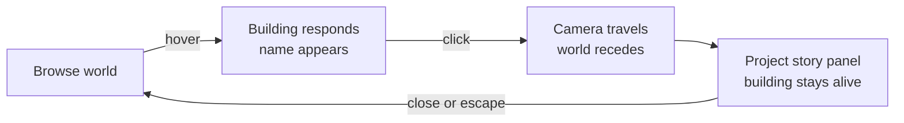

# Sibling Shipyard — Experience and Visual Design

## Context

The Shipyard must communicate a portfolio, current activity, and accumulated history through a single explorable world. The first design task is not broad asset production; it is proving a coherent visual grammar with three projects.

## Experience goal

Within ten seconds, a visitor should understand: **“This is a living miniature world of everything Akash and Skanda are building.”** The world opens calm and inviting, with enough motion to suggest life but enough negative space to make every building meaningful.

## First-load composition

```text
quiet background

                  [ Nexus · Growing ]
                         │
                    road / plaza
                     ╱         ╲
       [ Orion · Building ]   [ Spark · Live ]

               floating island edge
```

- Camera starts slightly wide, then settles gently into the browsing position.
- The fixed isometric view uses restrained parallax, not free rotation.
- Three strong silhouettes remain legible without labels.
- Empty land signals possibility rather than incompleteness.
- A restrained title may read `AKASH × SKANDA` and `Things we're building.`

## Visual language

| Property | Rule |
|---|---|
| Projection | Fixed isometric, based on a consistent tile grid |
| Geometry | Chunky, simplified, modular, and silhouette-first |
| Colour | Restricted pastel technology palette with project accents |
| Lighting | One global direction, soft directional shadows |
| Outlines | Minimal or absent, relying on shape and value separation |
| Texture | Nearly none; detail comes from geometry and motion |
| Scale | Standardised people, vehicles, props, floors, and tiles |
| Motion | Calm by default, playful and exaggerated for meaningful events |
| Density | Sparse initially, growing organically with the body of work |

## Building anatomy

```text
Project building
├── plot and footprint
├── base structure
├── modular floors or wings
├── roof feature
├── project identity and sign
├── landscaping
├── ambient activity
└── temporary status effect
```

Architecture records lasting achievement. Scaffolding, lights, traffic, smoke, and visitors communicate temporary state and disappear when that state changes.

## Core interaction flow



The project panel contains only what supports the scene: one-line description, stage, status, latest milestone, next milestone, activity history, and visit links. It must not become a dashboard.

## The first magic moment

1. The visitor selects Orion.
2. The camera travels to its construction site.
3. `Public Beta reached` is triggered.
4. A crane moves, a section rises, panels snap into place, and lights switch on.
5. Only after the physical change does the milestone label and date appear.

The emotional order matters: **change first, explanation second**.

## Accessibility and comfort

- Every project remains reachable through keyboard navigation and an equivalent compact list.
- Labels and panels meet readable contrast targets independently of the artwork.
- `prefers-reduced-motion` replaces camera flight and construction choreography with short fades and final-state changes.
- Zoom has defined limits and never traps browser scrolling or focus.
- Status is never communicated by colour alone.

## Asset gate for Shipyard Zero

Before producing a large library, approve one reference sheet containing:

- tile dimensions and projection angle
- palette and lighting direction
- island edge and road treatment
- one person, one vehicle, one tree, and one crane at canonical scale
- Orion, Spark, and Nexus silhouettes
- hover, selected, construction, live, and growing states

No broad asset generation starts until this sheet renders coherently in the actual camera.

## Deferred design forks

- Exact palette, tile ratio, and canonical sprite resolution
- Whether project detail appears at the side or in-world beside the building
- Sound and haptics
- Mobile scene density and navigation pattern
- Final landmark architecture for Nexus

