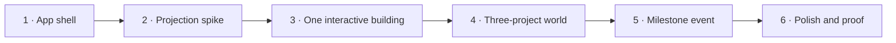

# Shipyard Zero — Implementation Plan

## Outcome

Ship a browser prototype where a visitor explores one floating island, identifies three projects, focuses one without leaving the world, and watches Orion physically upgrade when `Public Beta reached` is triggered.

## Scope contract

### Included

- Fixed isometric floating island
- Orion at Building, Spark at Live, Nexus at Growing
- Pan, bounded zoom, hover, keyboard selection, and click-to-focus
- Small project detail panel with latest and next milestone
- JSON-loaded projects and milestones
- One reusable `construction-upgrade` event
- Reduced-motion equivalent
- Responsive desktop and mobile presentation

### Excluded

- Authentication, editor, CMS, database, or live integrations
- Timeline travel, weather, procedural layout, or free camera rotation
- More than three projects or one milestone event type
- Full construction-kit extraction before the slice proves useful
- Production analytics or elaborate deployment infrastructure

## Build sequence

### 1 · App shell and contracts — S

- Scaffold React, TypeScript, Vite, tests, formatting, and static asset loading.
- Add validated `projects.json` and `milestones.json` with the three canonical projects.
- Mount one PixiJS application below the React UI layer.

**Exit test:** the app loads valid content, rejects a broken fixture, and renders a labelled empty canvas.

### 2 · Projection and camera spike — S

- Implement pure grid-to-screen and depth-key functions.
- Render a temporary tile island with a fixed isometric camera.
- Add bounded drag, wheel/pinch zoom, reset, and reduced-motion behaviour.

**Exit test:** projection tests pass and the island remains navigable at the smallest supported viewport.

### 3 · One interactive building — M

- Build the base `ProjectEntity` lifecycle and texture ownership.
- Add hit region, hover response, selection, click-to-focus, and keyboard equivalent.
- Connect selection to a small React detail panel.

**Exit test:** a first-time tester can identify, focus, read, and leave Orion without instruction.

### 4 · Three-project world — M

- Compose Orion, Spark, and Nexus with distinct silhouettes and status effects.
- Add road, plaza, landscaping, island edge, and restrained ambient motion.
- Verify occlusion and asset scale at representative desktop and mobile sizes.

**Exit test:** all three stages are distinguishable without reading their labels.

### 5 · Milestone event — M — critical path

- Compute the difference between Orion's current modules and milestone result.
- Sequence crane movement, section placement, panel snap, light-on, and label reveal.
- Commit the final state after completion and make replay deterministic for the demo.

**Exit test:** triggering `Public Beta reached` always ends in the correct upgraded state, including with reduced motion.

### 6 · Polish and proof — S

- Add loading, content-error, asset-error, and WebGL fallback states.
- Run unit, interaction, browser, accessibility, and performance checks.
- Capture the first-load and milestone-upgrade reference recordings.

**Exit test:** the complete magic-moment browser test passes and the agreed device check is smooth and readable.

## Initial verification matrix

| Layer | Proof |
|---|---|
| Projection | Unit tests for coordinate conversion and stable depth order |
| Content | Valid fixture loads, broken IDs/assets/links fail clearly |
| Store | Selection and milestone state-transition tests |
| World | Interaction tests for hover, focus, zoom bounds, and cleanup |
| Experience | Browser test for load → select Orion → trigger → final module visible |
| Accessibility | Keyboard route, readable semantic panel, reduced-motion route |
| Performance | Profile on one representative laptop and phone before M2 exit |

## First implementation backlog

1. **Orion Hero Plot:** replace only Orion with a production-quality layered isometric construction site.
2. Preserve hover, selection, camera focus, construction replay, and reduced-motion outcomes.
3. Compare the integrated scene against the beauty target at desktop, mobile, and 50% scale.
4. Decide whether layered assets meet the quality bar before producing Spark, Nexus, or a full atlas.
5. Build the remaining environment and buildings only after the Orion approval gate.

**Orion exit test:** without its label or accent, Orion reads as a construction site with coherent top, left, and right faces. Its Public Beta upgrade reaches the same final state with and without motion, current tests/build pass, and the default-camera screenshot is visually approved.

**Current status:** the first programmatic town block is integrated: raised island, roads, trees, lamps, distinct Orion/Spark/Nexus silhouettes, a walker, a service vehicle, and the deterministic Orion upgrade. The beauty target now guides composition rather than blocking the playable game-world slice.

## Stop condition

After Shipyard Zero, pause expansion and test the central claim: does the world communicate project state, and does the upgrade feel rewarding? Do not proceed to broad asset production, integrations, or timeline work until that answer is yes.
